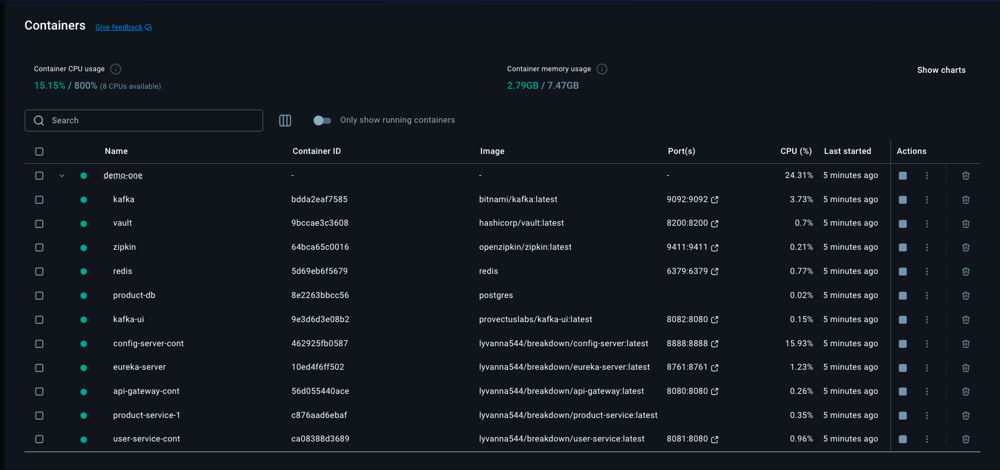

```bash
docker run -d --name zookeeper -p 2181:2181 zookeeper
docker run -d --name kafka -p 9092:9092 \
  -e KAFKA_ZOOKEEPER_CONNECT=zookeeper:2181 \
  -e KAFKA_ADVERTISED_LISTENERS=PLAINTEXT://localhost:9092 \
  -e KAFKA_LISTENERS=PLAINTEXT://0.0.0.0:9092 \
  --link zookeeper \
  confluentinc/cp-kafka

```
##### Requirement: 
- spring web 
- spring kafka 


* configuration for the yaml fle 
```yaml 
spring:
  kafka:
    bootstrap-servers: localhost:9092
    producer:
      key-serializer: org.apache.kafka.common.serialization.StringSerializer
      value-serializer: org.apache.kafka.common.serialization.StringSerializer

```
```java
@Service
public class KafkaProducerService {

    private final KafkaTemplate<String, String> kafkaTemplate;

    public KafkaProducerService(KafkaTemplate<String, String> kafkaTemplate) {
        this.kafkaTemplate = kafkaTemplate;
    }

    public void sendMessage(String message) {
        kafkaTemplate.send("test-topic", message);
    }
}

```


```bash
yq eval --input-format=json --output-format=yaml '.' student.json
```

